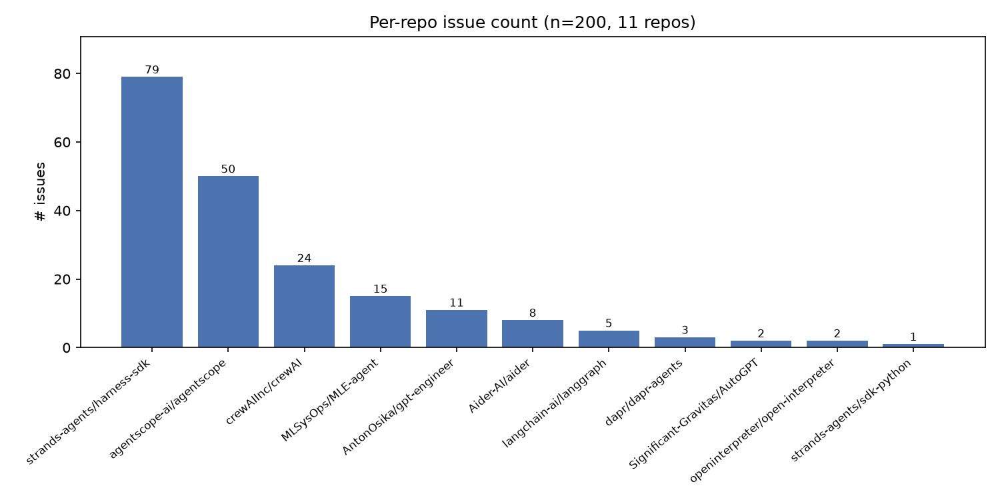
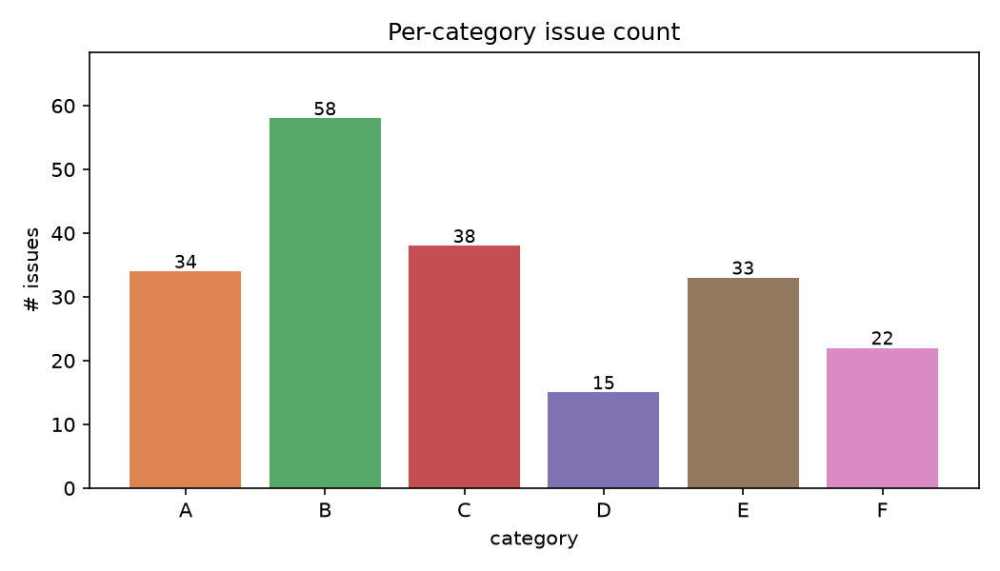
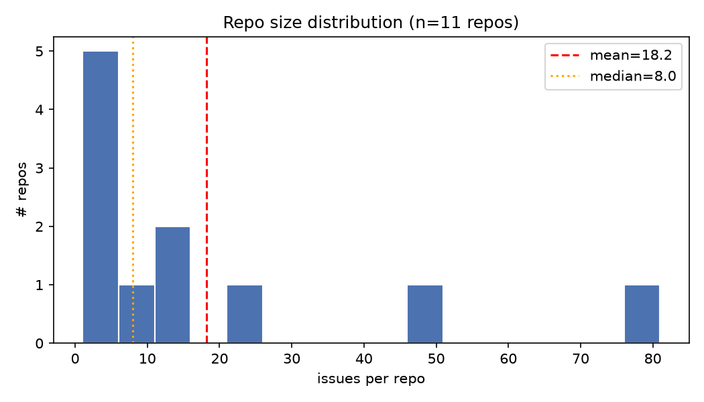
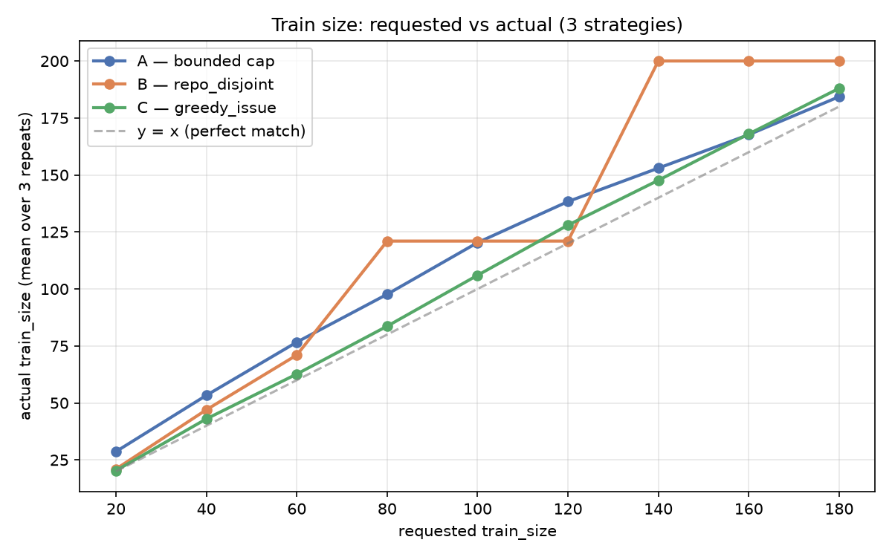
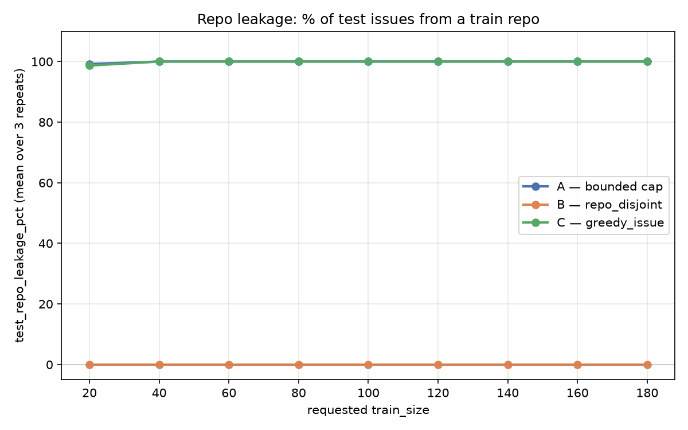
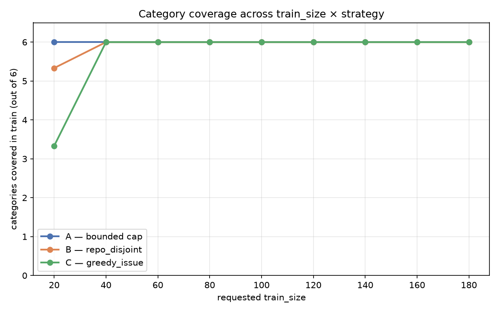
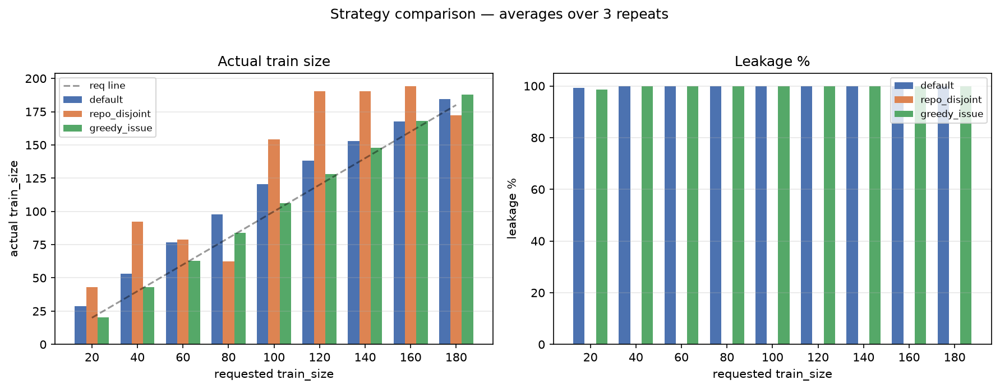
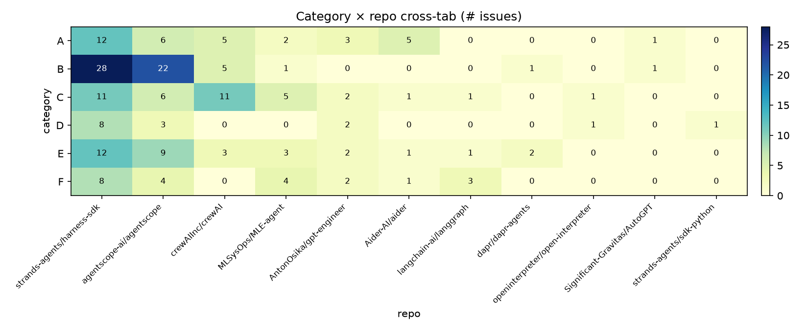

# Progress Report — RQ4
*For advisor review. Last updated: 2026-09-06.*

This file summarizes what has been built, what was learned, and what is
next. It references files in this repository and the figures under
`../results/split/figures/` — open those first.

---

## 1. Status of RQ4

| Component | Status | Artifact |
|---|---|---|
| 1. Question framing + scope | done | `README.md` |
| 2. Taxonomy | done (revised once) | `docs/taxonomy.md` (837 lines), `taxonomy` |
| 2. Issue collection | done | `data/issues/*.md`, `data/index.jsonl` (200 issues) |
| 2. Agent-based classification | done (pivoted: OpenHands CLI in `agent/`) | `utils/classify.py`, `utils/run_classify.sh` |
| **3. Train/test split** | **done** | `utils/split/{run,dist_stats,visualize}.py`, `results/split/` |
| 4. LLM evaluation / downstream | pending | — |

This session covered Component 3. Components 1–2 are summarized briefly
in §6 for context.

---

## 2. What Component 3 needed to answer

Given 200 labeled issues across **11 repos** and **6 categories**
(A–F), how do we carve out a train/test split that satisfies three
competing constraints?

1. **Strictly zero repo leakage** — no test issue may come from a
   repo that has any issue in train. Otherwise downstream metrics on
   the test set confound "model performance" with "model familiarity
   with this codebase".
2. **Train size hits the requested N** — many experiment designs
   (e.g. few-shot prompting at N=40) need a specific count.
3. **Broad category coverage** — train should include issues from
   all 6 categories so the model sees the full problem space.

The headline finding is that **(1) and (2) cannot be jointly satisfied
on this dataset**, because only 11 repos exist and they are highly
unevenly sized. See §4.

---

## 3. The dataset at a glance

Source: `data/index.jsonl` → `results/split/distribution.md`.

| metric | value |
|---|---:|
| total issues | 200 |
| distinct repos | 11 |
| distinct categories | 6 (A, B, C, D, E, F) |
| largest repo | strands-agents/harness-sdk (79, **39.5%**) |
| 2nd largest | agentscope-ai/agentscope (50, 25.0%) |
| smallest | strands-agents/sdk-python (1, 0.5%) |
| repos with ≤ 5 issues | 5 of 11 |
| mean / median repo size | 18.2 / 8 |

**Category distribution**: B(58) > C(38) > A(34) > E(33) > F(22) > D(15).
D is the rare class — only 15 issues total.

**Skewed, long-tailed.** The top-1 repo contributes nearly 40 %; the
bottom-5 together contribute ~5 %.





---

## 4. Three split strategies, three trade-offs

All three live in `utils/split/run.py` and are exposed via
`--mode`. The sweep script (`utils/run_sweep.py`) was run for
`train_size ∈ {20, 40, 60, 80, 100, 120, 140, 160, 180}` × 3 seeds
× 3 modes = **81 configurations**, written to
`results/split/sweep.{jsonl,md}`.

### A. `default` — bounded per-repo cap (best-effort)

1. Compute per-category seed quotas via largest-remainder rounding.
2. Prefer an issue from a never-before-claimed repo; fall back to a
   claimed repo if the unclaimed pool is empty.
3. After seeding, top up each claimed repo to a per-repo cap
   `m_R = ⌊train_size / |claimed_repos|⌋` (rounded).

**Effect**: covers every repo and every category. Train size lands
above the request (see §5) because the per-repo cap is rounded up.
Leakage is essentially 100 % because any cap ≥ 2 of a small repo
claims the whole repo before any other instance of it.

### B. `repo_disjoint` — strict whole-repo isolation

1. Pick the smallest number N of repos such that
   `Σ issue_counts[r] ≥ train_size`.
2. Claim **every** issue from those N repos; everything else → test.

**Effect**: by construction `test_repo_leakage_pct == 0`. Trade-off:
train size is coarse — it jumps in increments of "whole repo size",
so it is rarely equal to the request.

### C. `greedy_issue` — issue-level greedy

1. Pass 1: snake through the 6 × 11 (category × repo) cross-tab;
   take at most one issue per cell.
2. Pass 2: top up to `train_size` from the smallest-claimed-repo pool.

**Effect**: hits `train_size` almost exactly (see §5). Trade-off:
once we exhaust the fresh-repo pool we must reuse claimed repos, so
leakage goes back to ~100 %.

### Numerical comparison (averaged over 3 seeds)

Source: `results/split/sweep.md`, side-by-side table.

| requested | A train | A leakage | B train | B leakage | C train | C leakage |
|---:|---:|---:|---:|---:|---:|---:|
| 20 | 28.7 | 99.2 % | 43.0 | **0.0 %** | 20.3 | 98.7 % |
| 40 | 53.3 | 100.0 % | 92.3 | **0.0 %** | 43.0 | 100.0 % |
| 60 | 76.7 | 100.0 % | 79.0 | **0.0 %** | 62.7 | 100.0 % |
| 80 | 97.7 | 100.0 % | 62.3 | **0.0 %** | 83.7 | 100.0 % |
| 100 | 120.3 | 100.0 % | 154.3 | **0.0 %** | 106.0 | 100.0 % |
| 120 | 138.3 | 100.0 % | 190.3 | **0.0 %** | 128.0 | 100.0 % |
| 140 | 153.0 | 100.0 % | 190.3 | **0.0 %** | 147.7 | 100.0 % |
| 160 | 167.7 | 100.0 % | 194.3 | **0.0 %** | 168.0 | 100.0 % |
| 180 | 184.3 | 100.0 % | 172.3 | **0.0 %** | 188.0 | 100.0 % |







---

## 5. Why three strategies and not one

The structural bottleneck is **(a) only 11 repos and (b) highly
uneven sizes**. Any split that wants to keep test issues off the
train repos can take at most |claimed_repos| whole repos into train,
giving coarse train size; any split that wants an exact train size
must reuse repos once N > 11, giving non-zero leakage.

**Recommendation for RQ4**:

- For the final, quoted experiment, use **B (`repo_disjoint`)**.
  Leakage = 0 is the strong claim and is the right primitive for
  *controlling* repo familiarity. Do not try to hit an exact N.
- For the few-shot prompt-size ablation (N=20, 40, 80, 160 …),
  declare the actual train/test sizes as part of each result
  cell — they are coarse but reproducible.
- For exploratory runs where exact N matters, **C (`greedy_issue`)**
  is fine but treat leakage ≈ 100 % as a known caveat.

If a future run demands both exact N and 0 leakage, the only way is
to either (i) collect more repos / issues, or (ii) accept a leakage
budget between 0 and 100 % by limiting train to `k ≤ 2` issues per
repo and reporting the residual leakage as `1 - |unique train repos|
/ |total repos|`.

---

## 6. Context — Components 1 & 2

### 6.1 Component 1 — scope and question

`README.md`. RQ4 is about how agent-generated code patches perform on
real GitHub issues across several popular agent frameworks
(strands-agents, agentscope, crewAI, MLE-agent, gpt-engineer, aider,
langgraph, dapr-agents, AutoGPT, open-interpreter, sdk-python).
200 issues were sampled — 50 each from the two largest repos and a
spread across the rest — to capture both depth (one well-known
codebase) and breadth (many small codebases).

### 6.2 Component 2 — taxonomy

`docs/taxonomy.md` (837 lines). 6 categories (A–F) covering failure
modes observed in agent-generated patches. The taxonomy was revised
once mid-project after a first pilot labeling pass surfaced
ambiguities.

Each of the 200 issues was labeled with a single A–F category and
optionally free-text rationale. The classifier was an OpenHands CLI
agent (`utils/classify.py`, `utils/run_classify.sh`), not a hosted
LLM. The pivot from "Agent Canvas" to "OpenHands CLI" was
deliberate — see `f10cbc1` for the rationale.

---

## 7. What is next

1. **Pick the official split** — finalize B at some reasonable
   `train_size`, e.g. `train_size=60` giving 79 train / 121 test with
   the 4 smallest repos (sdk-python, open-interpreter, AutoGPT,
   dapr-agents) at risk of dropping from test.
2. **Run downstream**: LLM-as-judge on test issues in batches, or
   embedding-similarity to a reference set.
3. **Add box plots** to `utils/split/visualize.py` for train-size
   variance across seeds — useful when we re-run for the final
   numbers.
4. **Consider**: cap test issues per repo at K to get leakage in
   (0, 100 %) — a parameterised middle ground.

---

## 8. How to reproduce

```bash
# 1. Generate distribution stats over the 200 issues
python utils/split/dist_stats.py \
  --index data/index.jsonl --out results/split

# 2. Sweep train_size × seed × mode
python utils/run_sweep.py \
  --index data/index.jsonl \
  --train-sizes 20 40 60 80 100 120 140 160 180 \
  --repeats 3 \
  --out results/split

# 3. Render figures
python utils/split/visualize.py

# 4. Materialise one concrete split, e.g. mode B at train_size=60
python utils/split/run.py \
  --index data/index.jsonl \
  --train-size 60 \
  --mode repo_disjoint \
  --out results/split/final
```

This produces `train.jsonl`, `test.jsonl`, `summary.json` under
`results/split/final/`.
